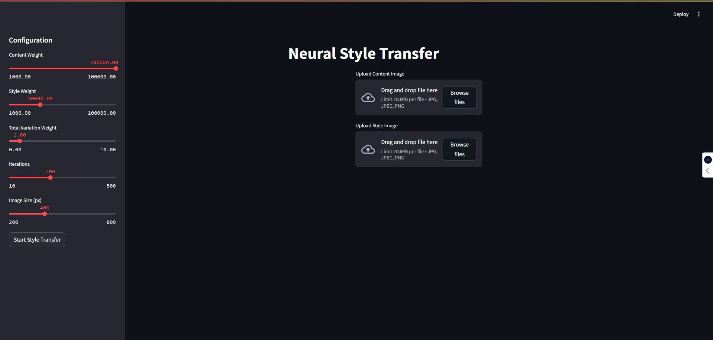

# Neural-Style-Transfer (NST)

Neural Style Transfer is the ability to create a new image (known as a pastiche) based on two input images: one representing the content and the other representing the artistic style.

## Overview <a name="overview"></a>

Neural style transfer is a technique that is used to take two images—a content image and a style reference image—and blend them together so that output image looks like the content image, but “painted” in the style of the style reference image.

## Getting Started <a name="getting-started"></a>

### File Description <a name="description"></a>

    Neural-Style-Transfer
        ├── data
        |   ├── content-images (Target images)
        |   |── output-images (Result images)
        |   ├── style-images (Style images)
        ├── models/definitions     
        │   ├── vgg19.py   <-- VGG19 model definition
        ├── app.py  <-- streamlit app to run in web
        ├── NST.py  <-- the main python file to run in CLI
        └── README.md

### Dependencies <a name="dependencies"></a>
*    Python 3.9+
*    Framework: PyTorch
*    Libraries: os, numpy, cv2, matplotlib, torchvision

### Usage <a name="usage"></a>

```
    $ pip install -r requirements.txt
```

#### To implement Neural Style Transfer on images of your own:

1. Clone the repository and move to the downloaded folder:
```
    $  git clone https://github.com/nazianafis/Neural-Style-Transfer
```

2. Move your content/style image(s) to their respective folders inside the `data` folder.

3. Go to `NST.py`, and in it, set the `PATH` variable to your downloaded folder. Also set `CONTENT_IMAGE`, `STYLE_IMAGE` variables as your desired images:
```
    $ PATH = <your_path>
   
    $ CONTENT_IMAGE = <your_content_image_name>
    $ STYLE_IMAGE = <you_style_image_name>
```
4. Run `NST.py`:
```
    $ python NST.py
```
5. Find your generated image in the `output-images` folder inside `data`.

## Web APP View

Following is the web app view of the project where you can upload your content and style images, edit the weights and iterations, and get the result.

Run `app.py`:
```
    $ streamlit run app.py
```




## Loss of 200 Iterations

Here is the loss data recorded during the optimization process over 200 iterations:
```
    L-BFGS | iteration: 000, total loss=11055056027648.0000, content_loss=      0.0000, style loss=11055048960000.0000, tv loss=6960354.0000
L-BFGS | iteration: 001, total loss=11055053930496.0000, content_loss=      0.0007, style loss=11055047040000.0000, tv loss=6960354.0000
L-BFGS | iteration: 002, total loss=11055053930496.0000, content_loss=      0.0017, style loss=11055046080000.0000, tv loss=6960355.0000
L-BFGS | iteration: 003, total loss=11055053930496.0000, content_loss=      0.0017, style loss=11055046080000.0000, tv loss=6960355.0000
L-BFGS | iteration: 004, total loss=11055053930496.0000, content_loss=      0.0017, style loss=11055046080000.0000, tv loss=6960355.0000
L-BFGS | iteration: 005, total loss=11055053930496.0000, content_loss=      0.0017, style loss=11055046080000.0000, tv loss=6960355.0000
L-BFGS | iteration: 006, total loss=11055053930496.0000, content_loss=      0.0017, style loss=11055046080000.0000, tv loss=6960355.0000
L-BFGS | iteration: 007, total loss=11055053930496.0000, content_loss=      0.0017, style loss=11055046080000.0000, tv loss=6960355.0000
L-BFGS | iteration: 008, total loss=11054895595520.0000, content_loss=      7.6808, style loss=11054888640000.0000, tv loss=6960521.0000
L-BFGS | iteration: 009, total loss=11054281129984.0000, content_loss=    181.4635, style loss=11054274240000.0000, tv loss=6961165.0000
L-BFGS | iteration: 010, total loss=11050808246272.0000, content_loss=   5482.1681, style loss=11050800960000.0000, tv loss=6964811.0000
L-BFGS | iteration: 011, total loss=11013657198592.0000, content_loss= 534555.4352, style loss=11013648960000.0000, tv loss=7004905.0000
L-BFGS | iteration: 012, total loss=10749008150528.0000, content_loss=34246951.2939, style loss=10748966400000.0000, tv loss=7356699.5000
L-BFGS | iteration: 013, total loss=9456962240512.0000, content_loss=166601745.6055, style loss=9456785280000.0000, tv loss=10089096.0000
L-BFGS | iteration: 014, total loss=6096928899072.0000, content_loss=397667358.3984, style loss=6096513600000.0000, tv loss=17913660.0000
L-BFGS | iteration: 015, total loss=109755313946624.0000, content_loss=3147574023.4375, style loss=109752099840000.0000, tv loss=63767520.0000
L-BFGS | iteration: 016, total loss=3927201284096.0000, content_loss=891002636.7188, style loss=3926279760000.0000, tv loss=30335646.0000
L-BFGS | iteration: 017, total loss=2903647453184.0000, content_loss=808257861.3281, style loss=2902810080000.0000, tv loss=29192648.0000
L-BFGS | iteration: 018, total loss=2349336887296.0000, content_loss=949087304.6875, style loss=2348355600000.0000, tv loss=32232810.0000
L-BFGS | iteration: 019, total loss=1730370600960.0000, content_loss=1190802343.7500, style loss=1729142760000.0000, tv loss=37144552.0000
L-BFGS | iteration: 020, total loss=1234368069632.0000, content_loss=1236702929.6875, style loss=1233093240000.0000, tv loss=38181536.0000
L-BFGS | iteration: 021, total loss=1021688872960.0000, content_loss=1284485742.1875, style loss=1020365040000.0000, tv loss=39346776.0000
L-BFGS | iteration: 022, total loss=732093612032.0000, content_loss=1358264843.7500, style loss=730693560000.0000, tv loss=41841632.0000
L-BFGS | iteration: 023, total loss=589107167232.0000, content_loss=1373783007.8125, style loss=587691180000.0000, tv loss=42194388.0000
L-BFGS | iteration: 024, total loss=637034430464.0000, content_loss=1507795996.0938, style loss=635480820000.0000, tv loss=45819500.0000
L-BFGS | iteration: 025, total loss=511239061504.0000, content_loss=1437425683.5938, style loss=509757780000.0000, tv loss=43841464.0000
L-BFGS | iteration: 026, total loss=472064294912.0000, content_loss=1417823339.8438, style loss=470602650000.0000, tv loss=43814184.0000
L-BFGS | iteration: 027, total loss=416781828096.0000, content_loss=1426280468.7500, style loss=415311930000.0000, tv loss=43620696.0000
L-BFGS | iteration: 028, total loss=342343680000.0000, content_loss=1498029199.2188, style loss=340801800000.0000, tv loss=43850220.0000
L-BFGS | iteration: 029, total loss=267081039872.0000, content_loss=1570343359.3750, style loss=265466700000.0000, tv loss=43987728.0000
L-BFGS | iteration: 030, total loss=260975017984.0000, content_loss=1640741210.9375, style loss=259288980000.0000, tv loss=45300928.0000
L-BFGS | iteration: 031, total loss=247985684480.0000, content_loss=1610512304.6875, style loss=246330480000.0000, tv loss=44699968.0000
L-BFGS | iteration: 032, total loss=222724718592.0000, content_loss=1610275585.9375, style loss=221069730000.0000, tv loss=44712000.0000
L-BFGS | iteration: 033, total loss=190371020800.0000, content_loss=1598860546.8750, style loss=188727075000.0000, tv loss=45069408.0000
L-BFGS | iteration: 034, total loss=161308311552.0000, content_loss=1618446191.4062, style loss=159644850000.0000, tv loss=45019520.0000
L-BFGS | iteration: 035, total loss=157677518848.0000, content_loss=1642678320.3125, style loss=155989005000.0000, tv loss=45838128.0000
L-BFGS | iteration: 036, total loss=151643586560.0000, content_loss=1633728515.6250, style loss=149964390000.0000, tv loss=45465028.0000
L-BFGS | iteration: 037, total loss=134636118016.0000, content_loss=1642869140.6250, style loss=132947775000.0000, tv loss=45471328.0000
L-BFGS | iteration: 038, total loss=117692727296.0000, content_loss=1662325781.2500, style loss=115985062500.0000, tv loss=45332640.0000
L-BFGS | iteration: 039, total loss=109922803712.0000, content_loss=1666977734.3750, style loss=108210105000.0000, tv loss=45722912.0000
L-BFGS | iteration: 040, total loss=92386877440.0000, content_loss=1668791992.1875, style loss=90672780000.0000, tv loss=45304424.0000
L-BFGS | iteration: 041, total loss=86215639040.0000, content_loss=1682441992.1875, style loss=84487755000.0000, tv loss=45442464.0000
L-BFGS | iteration: 042, total loss=78864678912.0000, content_loss=1703369140.6250, style loss=77115705000.0000, tv loss=45608644.0000
L-BFGS | iteration: 043, total loss=72494776320.0000, content_loss=1707298242.1875, style loss=70741957500.0000, tv loss=45521368.0000
L-BFGS | iteration: 044, total loss=69433237504.0000, content_loss=1679609960.9375, style loss=67707870000.0000, tv loss=45755676.0000
L-BFGS | iteration: 045, total loss=62137536512.0000, content_loss=1701668945.3125, style loss=60390322500.0000, tv loss=45543324.0000
L-BFGS | iteration: 046, total loss=58807021568.0000, content_loss=1707010351.5625, style loss=57054427500.0000, tv loss=45579952.0000
L-BFGS | iteration: 047, total loss=64231428096.0000, content_loss=1686684960.9375, style loss=62498808750.0000, tv loss=45935568.0000
L-BFGS | iteration: 048, total loss=54238814208.0000, content_loss=1701278125.0000, style loss=52491851250.0000, tv loss=45685576.0000
L-BFGS | iteration: 049, total loss=49772494848.0000, content_loss=1713804882.8125, style loss=48013091250.0000, tv loss=45602056.0000
L-BFGS | iteration: 050, total loss=46223269888.0000, content_loss=1732541796.8750, style loss=44444955000.0000, tv loss=45771672.0000
L-BFGS | iteration: 051, total loss=42898313216.0000, content_loss=1736516992.1875, style loss=41116140000.0000, tv loss=45656512.0000
L-BFGS | iteration: 052, total loss=40587141120.0000, content_loss=1725796093.7500, style loss=38815623750.0000, tv loss=45718904.0000
L-BFGS | iteration: 053, total loss=38406672384.0000, content_loss=1726848828.1250, style loss=36633997500.0000, tv loss=45826376.0000
L-BFGS | iteration: 054, total loss=35898646528.0000, content_loss=1726435742.1875, style loss=34126395000.0000, tv loss=45815616.0000
L-BFGS | iteration: 055, total loss=34438500352.0000, content_loss=1720238085.9375, style loss=32672287500.0000, tv loss=45978604.0000
L-BFGS | iteration: 056, total loss=32659789824.0000, content_loss=1729913867.1875, style loss=30883985625.0000, tv loss=45890280.0000
L-BFGS | iteration: 057, total loss=31424659456.0000, content_loss=1733098828.1250, style loss=29645660625.0000, tv loss=45899144.0000
L-BFGS | iteration: 058, total loss=29917575168.0000, content_loss=1728660546.8750, style loss=28142919375.0000, tv loss=45993656.0000
L-BFGS | iteration: 059, total loss=28245663744.0000, content_loss=1739495507.8125, style loss=26460326250.0000, tv loss=45842640.0000
L-BFGS | iteration: 060, total loss=27465242624.0000, content_loss=1737904882.8125, style loss=25681436250.0000, tv loss=45902384.0000
L-BFGS | iteration: 061, total loss=26271258624.0000, content_loss=1736245898.4375, style loss=24488938125.0000, tv loss=46075080.0000
L-BFGS | iteration: 062, total loss=25187641344.0000, content_loss=1736814257.8125, style loss=23404721250.0000, tv loss=46104624.0000
L-BFGS | iteration: 063, total loss=23399206912.0000, content_loss=1737217773.4375, style loss=21615744375.0000, tv loss=46243608.0000
L-BFGS | iteration: 064, total loss=22011088896.0000, content_loss=1746553906.2500, style loss=20218231875.0000, tv loss=46301508.0000
L-BFGS | iteration: 065, total loss=20883513344.0000, content_loss=1748407812.5000, style loss=19088673750.0000, tv loss=46432608.0000
L-BFGS | iteration: 066, total loss=20393076736.0000, content_loss=1751803906.2500, style loss=18594954375.0000, tv loss=46317032.0000
L-BFGS | iteration: 067, total loss=19681830912.0000, content_loss=1758616210.9375, style loss=17876793750.0000, tv loss=46421720.0000
L-BFGS | iteration: 068, total loss=19190349824.0000, content_loss=1760597070.3125, style loss=17383271250.0000, tv loss=46481536.0000
L-BFGS | iteration: 069, total loss=18706317312.0000, content_loss=1755385351.5625, style loss=16904416875.0000, tv loss=46515104.0000
L-BFGS | iteration: 070, total loss=17749647360.0000, content_loss=1739188671.8750, style loss=15963802500.0000, tv loss=46655296.0000
L-BFGS | iteration: 071, total loss=17214027776.0000, content_loss=1734351171.8750, style loss=15433051875.0000, tv loss=46625348.0000
L-BFGS | iteration: 072, total loss=16609882112.0000, content_loss=1727349218.7500, style loss=14835795000.0000, tv loss=46737448.0000
L-BFGS | iteration: 073, total loss=16216934400.0000, content_loss=1731525976.5625, style loss=14438645625.0000, tv loss=46763424.0000
L-BFGS | iteration: 074, total loss=15691392000.0000, content_loss=1741158203.1250, style loss=13903435312.5000, tv loss=46798116.0000
L-BFGS | iteration: 075, total loss=15164432384.0000, content_loss=1747729101.5625, style loss=13369792500.0000, tv loss=46910132.0000
L-BFGS | iteration: 076, total loss=14599762944.0000, content_loss=1750896679.6875, style loss=12801822187.5000, tv loss=47044100.0000
L-BFGS | iteration: 077, total loss=14237179904.0000, content_loss=1753034570.3125, style loss=12437182500.0000, tv loss=46962620.0000
L-BFGS | iteration: 078, total loss=13901418496.0000, content_loss=1748919921.8750, style loss=12105423750.0000, tv loss=47073936.0000
L-BFGS | iteration: 079, total loss=13554618368.0000, content_loss=1745133007.8125, style loss=11762292187.5000, tv loss=47194296.0000
L-BFGS | iteration: 080, total loss=13186919424.0000, content_loss=1742891406.2500, style loss=11396814375.0000, tv loss=47213108.0000
L-BFGS | iteration: 081, total loss=12708035584.0000, content_loss=1737396289.0625, style loss=10923327187.5000, tv loss=47312352.0000
L-BFGS | iteration: 082, total loss=12306958336.0000, content_loss=1741997070.3125, style loss=10517542500.0000, tv loss=47418704.0000
L-BFGS | iteration: 074, total loss=15691392000.0000, content_loss=1741158203.1250, style loss=13903435312.5000, tv loss=46798116.0000
L-BFGS | iteration: 075, total loss=15164432384.0000, content_loss=1747729101.5625, style loss=13369792500.0000, tv loss=46910132.0000
L-BFGS | iteration: 076, total loss=14599762944.0000, content_loss=1750896679.6875, style loss=12801822187.5000, tv loss=47044100.0000
L-BFGS | iteration: 077, total loss=14237179904.0000, content_loss=1753034570.3125, style loss=12437182500.0000, tv loss=46962620.0000
L-BFGS | iteration: 078, total loss=13901418496.0000, content_loss=1748919921.8750, style loss=12105423750.0000, tv loss=47073936.0000
L-BFGS | iteration: 079, total loss=13554618368.0000, content_loss=1745133007.8125, style loss=11762292187.5000, tv loss=47194296.0000
L-BFGS | iteration: 080, total loss=13186919424.0000, content_loss=1742891406.2500, style loss=11396814375.0000, tv loss=47213108.0000
L-BFGS | iteration: 081, total loss=12708035584.0000, content_loss=1737396289.0625, style loss=10923327187.5000, tv loss=47312352.0000
L-BFGS | iteration: 082, total loss=12306958336.0000, content_loss=1741997070.3125, style loss=10517542500.0000, tv loss=47418704.0000
L-BFGS | iteration: 083, total loss=12006040576.0000, content_loss=1734623437.5000, style loss=10223935312.5000, tv loss=47481368.0000
L-BFGS | iteration: 075, total loss=15164432384.0000, content_loss=1747729101.5625, style loss=13369792500.0000, tv loss=46910132.0000
L-BFGS | iteration: 076, total loss=14599762944.0000, content_loss=1750896679.6875, style loss=12801822187.5000, tv loss=47044100.0000
L-BFGS | iteration: 077, total loss=14237179904.0000, content_loss=1753034570.3125, style loss=12437182500.0000, tv loss=46962620.0000
L-BFGS | iteration: 078, total loss=13901418496.0000, content_loss=1748919921.8750, style loss=12105423750.0000, tv loss=47073936.0000
L-BFGS | iteration: 079, total loss=13554618368.0000, content_loss=1745133007.8125, style loss=11762292187.5000, tv loss=47194296.0000
L-BFGS | iteration: 080, total loss=13186919424.0000, content_loss=1742891406.2500, style loss=11396814375.0000, tv loss=47213108.0000
L-BFGS | iteration: 081, total loss=12708035584.0000, content_loss=1737396289.0625, style loss=10923327187.5000, tv loss=47312352.0000
L-BFGS | iteration: 082, total loss=12306958336.0000, content_loss=1741997070.3125, style loss=10517542500.0000, tv loss=47418704.0000
L-BFGS | iteration: 083, total loss=12006040576.0000, content_loss=1734623437.5000, style loss=10223935312.5000, tv loss=47481368.0000
L-BFGS | iteration: 077, total loss=14237179904.0000, content_loss=1753034570.3125, style loss=12437182500.0000, tv loss=46962620.0000
L-BFGS | iteration: 078, total loss=13901418496.0000, content_loss=1748919921.8750, style loss=12105423750.0000, tv loss=47073936.0000
L-BFGS | iteration: 079, total loss=13554618368.0000, content_loss=1745133007.8125, style loss=11762292187.5000, tv loss=47194296.0000
L-BFGS | iteration: 080, total loss=13186919424.0000, content_loss=1742891406.2500, style loss=11396814375.0000, tv loss=47213108.0000
L-BFGS | iteration: 081, total loss=12708035584.0000, content_loss=1737396289.0625, style loss=10923327187.5000, tv loss=47312352.0000
L-BFGS | iteration: 082, total loss=12306958336.0000, content_loss=1741997070.3125, style loss=10517542500.0000, tv loss=47418704.0000
L-BFGS | iteration: 083, total loss=12006040576.0000, content_loss=1734623437.5000, style loss=10223935312.5000, tv loss=47481368.0000
L-BFGS | iteration: 079, total loss=13554618368.0000, content_loss=1745133007.8125, style loss=11762292187.5000, tv loss=47194296.0000
L-BFGS | iteration: 080, total loss=13186919424.0000, content_loss=1742891406.2500, style loss=11396814375.0000, tv loss=47213108.0000
L-BFGS | iteration: 081, total loss=12708035584.0000, content_loss=1737396289.0625, style loss=10923327187.5000, tv loss=47312352.0000
L-BFGS | iteration: 082, total loss=12306958336.0000, content_loss=1741997070.3125, style loss=10517542500.0000, tv loss=47418704.0000
L-BFGS | iteration: 083, total loss=12006040576.0000, content_loss=1734623437.5000, style loss=10223935312.5000, tv loss=47481368.0000
L-BFGS | iteration: 081, total loss=12708035584.0000, content_loss=1737396289.0625, style loss=10923327187.5000, tv loss=47312352.0000
L-BFGS | iteration: 082, total loss=12306958336.0000, content_loss=1741997070.3125, style loss=10517542500.0000, tv loss=47418704.0000
L-BFGS | iteration: 083, total loss=12006040576.0000, content_loss=1734623437.5000, style loss=10223935312.5000, tv loss=47481368.0000
L-BFGS | iteration: 082, total loss=12306958336.0000, content_loss=1741997070.3125, style loss=10517542500.0000, tv loss=47418704.0000
L-BFGS | iteration: 083, total loss=12006040576.0000, content_loss=1734623437.5000, style loss=10223935312.5000, tv loss=47481368.0000
L-BFGS | iteration: 084, total loss=11788456960.0000, content_loss=1733351562.5000, style loss=10007616562.5000, tv loss=47489284.0000
L-BFGS | iteration: 083, total loss=12006040576.0000, content_loss=1734623437.5000, style loss=10223935312.5000, tv loss=47481368.0000
L-BFGS | iteration: 084, total loss=11788456960.0000, content_loss=1733351562.5000, style loss=10007616562.5000, tv loss=47489284.0000
L-BFGS | iteration: 084, total loss=11788456960.0000, content_loss=1733351562.5000, style loss=10007616562.5000, tv loss=47489284.0000
L-BFGS | iteration: 085, total loss=11697011712.0000, content_loss=1730541601.5625, style loss=9918706875.0000, tv loss=47763808.0000
L-BFGS | iteration: 086, total loss=11537187840.0000, content_loss=1732019726.5625, style loss=9757526250.0000, tv loss=47642104.0000
L-BFGS | iteration: 087, total loss=11188706304.0000, content_loss=1737476171.8750, style loss=9403619062.5000, tv loss=47610652.0000
L-BFGS | iteration: 088, total loss=10961471488.0000, content_loss=1734330468.7500, style loss=9179461875.0000, tv loss=47679288.0000
L-BFGS | iteration: 089, total loss=10609891328.0000, content_loss=1728119921.8750, style loss=8833934062.5000, tv loss=47837304.0000
L-BFGS | iteration: 085, total loss=11697011712.0000, content_loss=1730541601.5625, style loss=9918706875.0000, tv loss=47763808.0000
L-BFGS | iteration: 086, total loss=11537187840.0000, content_loss=1732019726.5625, style loss=9757526250.0000, tv loss=47642104.0000
L-BFGS | iteration: 087, total loss=11188706304.0000, content_loss=1737476171.8750, style loss=9403619062.5000, tv loss=47610652.0000
L-BFGS | iteration: 088, total loss=10961471488.0000, content_loss=1734330468.7500, style loss=9179461875.0000, tv loss=47679288.0000
L-BFGS | iteration: 089, total loss=10609891328.0000, content_loss=1728119921.8750, style loss=8833934062.5000, tv loss=47837304.0000
L-BFGS | iteration: 087, total loss=11188706304.0000, content_loss=1737476171.8750, style loss=9403619062.5000, tv loss=47610652.0000
L-BFGS | iteration: 088, total loss=10961471488.0000, content_loss=1734330468.7500, style loss=9179461875.0000, tv loss=47679288.0000
L-BFGS | iteration: 089, total loss=10609891328.0000, content_loss=1728119921.8750, style loss=8833934062.5000, tv loss=47837304.0000
L-BFGS | iteration: 090, total loss=10432417792.0000, content_loss=1726455273.4375, style loss=8658124687.5000, tv loss=47837296.0000
L-BFGS | iteration: 091, total loss=10280840192.0000, content_loss=1726988476.5625, style loss=8505958125.0000, tv loss=47893052.0000
L-BFGS | iteration: 088, total loss=10961471488.0000, content_loss=1734330468.7500, style loss=9179461875.0000, tv loss=47679288.0000
L-BFGS | iteration: 089, total loss=10609891328.0000, content_loss=1728119921.8750, style loss=8833934062.5000, tv loss=47837304.0000
L-BFGS | iteration: 090, total loss=10432417792.0000, content_loss=1726455273.4375, style loss=8658124687.5000, tv loss=47837296.0000
L-BFGS | iteration: 091, total loss=10280840192.0000, content_loss=1726988476.5625, style loss=8505958125.0000, tv loss=47893052.0000
L-BFGS | iteration: 092, total loss=10056797184.0000, content_loss=1727489648.4375, style loss=8281299375.0000, tv loss=48007908.0000
L-BFGS | iteration: 090, total loss=10432417792.0000, content_loss=1726455273.4375, style loss=8658124687.5000, tv loss=47837296.0000
L-BFGS | iteration: 091, total loss=10280840192.0000, content_loss=1726988476.5625, style loss=8505958125.0000, tv loss=47893052.0000
L-BFGS | iteration: 092, total loss=10056797184.0000, content_loss=1727489648.4375, style loss=8281299375.0000, tv loss=48007908.0000
L-BFGS | iteration: 093, total loss=9912787968.0000, content_loss=1728864062.5000, style loss=8135910937.5000, tv loss=48013772.0000
L-BFGS | iteration: 091, total loss=10280840192.0000, content_loss=1726988476.5625, style loss=8505958125.0000, tv loss=47893052.0000
L-BFGS | iteration: 092, total loss=10056797184.0000, content_loss=1727489648.4375, style loss=8281299375.0000, tv loss=48007908.0000
L-BFGS | iteration: 093, total loss=9912787968.0000, content_loss=1728864062.5000, style loss=8135910937.5000, tv loss=48013772.0000
L-BFGS | iteration: 092, total loss=10056797184.0000, content_loss=1727489648.4375, style loss=8281299375.0000, tv loss=48007908.0000
L-BFGS | iteration: 093, total loss=9912787968.0000, content_loss=1728864062.5000, style loss=8135910937.5000, tv loss=48013772.0000
L-BFGS | iteration: 093, total loss=9912787968.0000, content_loss=1728864062.5000, style loss=8135910937.5000, tv loss=48013772.0000
L-BFGS | iteration: 094, total loss=9706859520.0000, content_loss=1727527343.7500, style loss=7931131875.0000, tv loss=48201024.0000
L-BFGS | iteration: 094, total loss=9706859520.0000, content_loss=1727527343.7500, style loss=7931131875.0000, tv loss=48201024.0000
L-BFGS | iteration: 095, total loss=9409859584.0000, content_loss=1732918945.3125, style loss=7628835000.0000, tv loss=48104976.0000
L-BFGS | iteration: 096, total loss=9268001792.0000, content_loss=1731778906.2500, style loss=7488072656.2500, tv loss=48150944.0000
L-BFGS | iteration: 096, total loss=9268001792.0000, content_loss=1731778906.2500, style loss=7488072656.2500, tv loss=48150944.0000
L-BFGS | iteration: 097, total loss=9094817792.0000, content_loss=1727702148.4375, style loss=7318876406.2500, tv loss=48239964.0000
L-BFGS | iteration: 098, total loss=8920497152.0000, content_loss=1726314453.1250, style loss=7145937656.2500, tv loss=48245424.0000
L-BFGS | iteration: 099, total loss=8681367552.0000, content_loss=1725276171.8750, style loss=6907760156.2500, tv loss=48330576.0000
L-BFGS | iteration: 100, total loss=8507762176.0000, content_loss=1722183593.7500, style loss=6737196093.7500, tv loss=48382296.0000
L-BFGS | iteration: 101, total loss=8375716864.0000, content_loss=1724659960.9375, style loss=6602622187.5000, tv loss=48435096.0000
L-BFGS | iteration: 102, total loss=8216430080.0000, content_loss=1726222460.9375, style loss=6441714843.7500, tv loss=48493192.0000
L-BFGS | iteration: 103, total loss=8044673024.0000, content_loss=1725634375.0000, style loss=6270454687.5000, tv loss=48583656.0000
L-BFGS | iteration: 104, total loss=7899746304.0000, content_loss=1720349414.0625, style loss=6130800000.0000, tv loss=48597128.0000
L-BFGS | iteration: 105, total loss=7786949120.0000, content_loss=1717037500.0000, style loss=6021168281.2500, tv loss=48743520.0000
L-BFGS | iteration: 106, total loss=7916873216.0000, content_loss=1722865625.0000, style loss=6145300312.5000, tv loss=48707216.0000
L-BFGS | iteration: 107, total loss=7705704448.0000, content_loss=1719121679.6875, style loss=5937853593.7500, tv loss=48729272.0000
L-BFGS | iteration: 108, total loss=7634017792.0000, content_loss=1718571289.0625, style loss=5866722187.5000, tv loss=48724496.0000
L-BFGS | iteration: 109, total loss=7451891200.0000, content_loss=1717232812.5000, style loss=5685886406.2500, tv loss=48772192.0000
L-BFGS | iteration: 110, total loss=7314514944.0000, content_loss=1716993945.3125, style loss=5548686562.5000, tv loss=48834592.0000
L-BFGS | iteration: 111, total loss=7166199808.0000, content_loss=1713683007.8125, style loss=5403557343.7500, tv loss=48959688.0000
L-BFGS | iteration: 112, total loss=7053949952.0000, content_loss=1716191406.2500, style loss=5288792343.7500, tv loss=48966196.0000
L-BFGS | iteration: 113, total loss=6988406272.0000, content_loss=1713951757.8125, style loss=5225420156.2500, tv loss=49034000.0000
L-BFGS | iteration: 114, total loss=6887588352.0000, content_loss=1709591406.2500, style loss=5128937343.7500, tv loss=49059568.0000
L-BFGS | iteration: 115, total loss=6782563840.0000, content_loss=1706146875.0000, style loss=5027284687.5000, tv loss=49132780.0000
L-BFGS | iteration: 116, total loss=6672707584.0000, content_loss=1703851171.8750, style loss=4919727656.2500, tv loss=49129136.0000
L-BFGS | iteration: 117, total loss=6569720832.0000, content_loss=1700793945.3125, style loss=4819689843.7500, tv loss=49236832.0000
```
